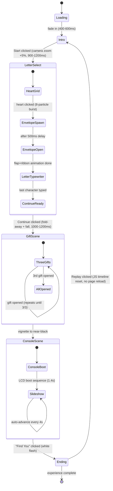

# Scene Flow Diagram

Every arrow is a `SceneManager.transitionTo()` call; the background/star/
cloud/heart timeline never stops, even across transitions.

## Notes for implementation
- `LetterSelect`, `GiftScene` and `ConsoleScene` are drawn as sub-states
  because each owns an internal mini-flow, but externally `SceneManager`
  only ever sees five top-level scenes plus the replay loop.
- Replay resets scene state objects and re-runs each scene's `init()` —
  it does not reload `index.html`, per the spec.
- The background/character ambient timelines belong to `main.js`, not to
  any individual scene, precisely so they can survive every transition
  above without being torn down and rebuilt.
